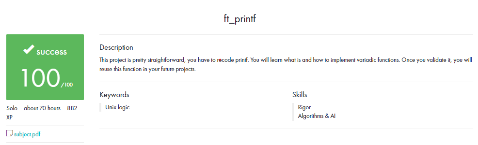

  

# Table of Contents
- [Table of Contents](#table-of-contents)
- [0. Description](#0-description)
- [1. Prototype](#1-prototype)
- [2. Requirements](#2-requirements)
- [3. Conversions Implemented](#conversions-implemented)
# 0. Description

Write a library that contains ft_printf(), a function that will mimic the original **printf()**.

# 1. Prototype

    
    💡 `int     ft_printf(const char *str, ...);`

 
# 2. Requirements
    
- Don't implement the buffer management of the original **printf()**.
    
- Your function has to handle the following conversions: cspdiuxX%
    
- Your function will be compared against the orginal **printf()**
    
- You must use the command **ar** to create your library. Using the libtool command is forbidden.
    
- Your **libftprintf.a** has to be created at the root of your repository.

# Conversions Implemented

- **%c**

    Prints a single character.
    
    
- **%s**
    
    Prints a string (as defined by the common C convention).
    
- **%p**
    
    The void * pointer argument has to be printed in hexadecimal format.
    
    
- **%d**
    
    Prints a decimal (base 10) number.
    
- **%i**
    
    Prints a integer in base 10.
    
    
- **%u**

    Prints an unsigned decimal (base 10) number

- **%x**

    Prints a number in hexadecimal (base 16) lowercase format.    
    
- **%X**
    
    Prints a number in hexadecimal (base 16) uppercase format.

- **%%**
    
    Prints a percent sign.
    

 
